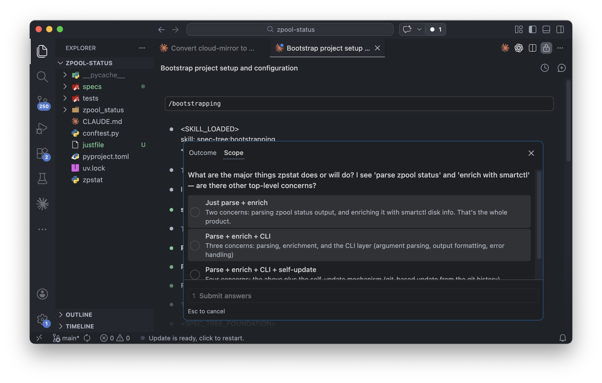
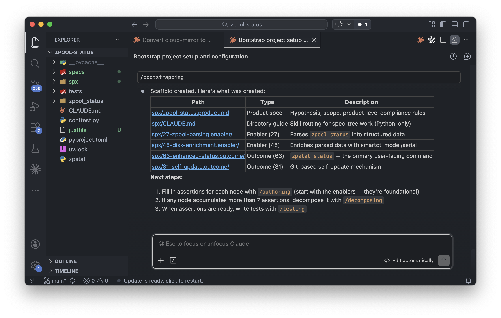
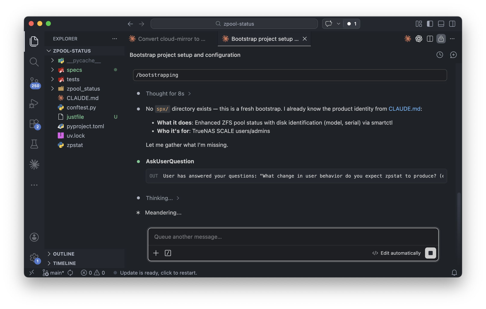
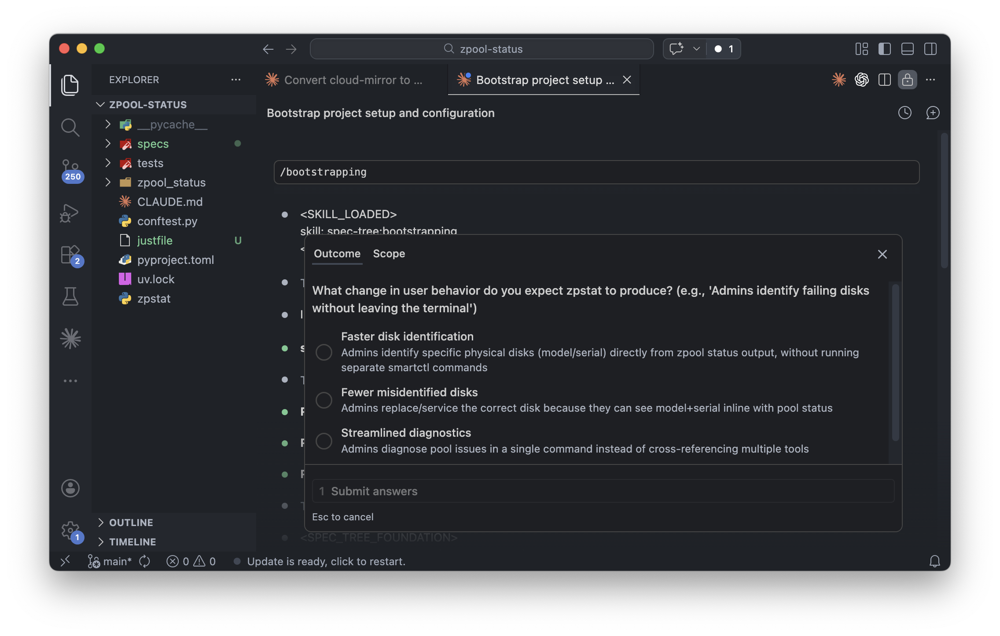
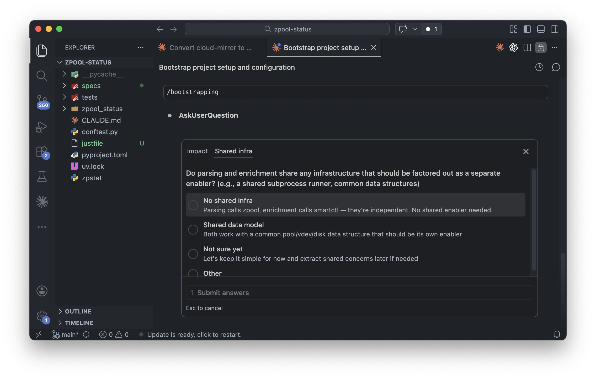
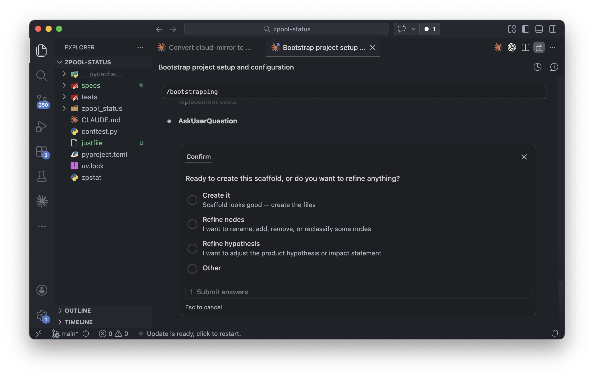

# Outcome Engineering Plugin Marketplace

A Claude Code plugin marketplace for [Outcome Engineering](https://outcome.engineering) — spec-driven development where a durable map of your product drives all implementation.

> `/bootstrap` interviews you about your product, then scaffolds a spec tree — the durable map that drives all implementation.



## Philosophy

1. **RTFM:** Follow state-of-the-art (SOTA) model prompting guidance, such as [structured prompts based on XML tags](https://docs.prompts.ag/guidelines)
2. **KILO:** *Keep It Local and Observable* — the golden source for all specifications lives locally within the project's Git repository

## Quick Start

### 1. Install the spx CLI

```bash
npm install -g @outcomeeng/spx
```

The [spx CLI](https://www.npmjs.com/package/@outcomeeng/spx) is the developer tool for spec-driven development. Required by all engineering plugins.

### 2. Add the marketplace and install plugins

```bash
# Add the marketplace
claude plugin marketplace add outcomeeng/claude

# Spec-driven development (requires spx CLI)
claude plugin install spec-tree@outcomeeng

# Language plugins (install per project, require spx CLI)
claude plugin install python@outcomeeng
claude plugin install typescript@outcomeeng
```

### 3. Bootstrap your spec tree

```text
> /bootstrap                       # set up a new spec tree
```



### 4. Author, implement, commit

```text
> /author outcome for search       # author a new outcome node
> /author PDR for auth policy      # author a product constraint
> /author ADR for caching strategy # author an architecture decision
> /tdd                             # start the TDD flow
> /commit                          # commit with Conventional Commits
```

See the [full tutorial](docs/tutorial.md) for the complete workflow — from bootstrapping to handoffs.

### Also available (no spx CLI required)

```bash
claude plugin install prose@outcomeeng       # writing and reviewing prose
claude plugin install claude@outcomeeng      # meta-skills for plugin development
```

### Updating plugins

```bash
claude plugin marketplace update outcomeeng
```

## Plugins

### spec-tree

The core of [Outcome Engineering](https://outcome.engineering). Three phases: spec-tree maintenance, implementation, commit.

<details>
<summary><strong><code>/bootstrap</code> in action</strong> — interactive product interview and scaffold</summary>

| Step                                                                   | Screenshot                                                                              |
| ---------------------------------------------------------------------- | --------------------------------------------------------------------------------------- |
| **Detect product** — reads CLAUDE.md, identifies what the product does |           |
| **Outcome hypothesis** — what user behavior change do you expect?      |     |
| **Scope** — what are the major concerns?                               |         |
| **Shared infrastructure** — should anything be an enabler?             |  |
| **Confirm** — review the scaffold before creating files                |       |
| **Result** — scaffold created with product spec, guides, and nodes     |        |

</details>

| Type    | Name                  | Phase | Purpose                                         |
| ------- | --------------------- | ----- | ----------------------------------------------- |
| Skill   | `/understanding`      | 1     | Foundation skill — loaded before any other      |
| Skill   | `/contextualizing`    | 1     | Deterministic context loading from tree         |
| Skill   | `/bootstrapping`      | 1     | Interview user, scaffold new spec tree          |
| Skill   | `/authoring`          | 1     | Add, define, create specs and nodes             |
| Skill   | `/decomposing`        | 1     | Break down, split, scope work                   |
| Skill   | `/refactoring`        | 1     | Move nodes, re-scope, extract shared enablers   |
| Skill   | `/aligning`           | 1     | Review, check consistency, audit, find gaps     |
| Skill   | `/testing`            | 2     | Write tests driven by spec assertions           |
| Skill   | `/reviewing-tests`    | 2     | Adversarial review of test evidence             |
| Skill   | `/coding`             | 2     | TDD flow: architect, test, code + review gates  |
| Skill   | `/committing-changes` | 3     | Conventional Commits with selective staging     |
| Command | `/bootstrap`          |       | Set up a new spec tree                          |
| Command | `/author`             |       | Author a spec tree artifact (auto-detects type) |
| Command | `/commit`             |       | Git commit with Conventional Commits            |
| Command | `/tdd`                |       | Start TDD flow                                  |
| Command | `/rtfm`               |       | Stop ad hoc work, follow methodology            |
| Command | `/clarify`            |       | Clarify ambiguous requirements                  |
| Command | `/handoff`            |       | Create timestamped context handoff              |
| Command | `/pickup`             |       | Load and continue from previous handoff         |

### typescript

Complete TypeScript development workflow. Requires spx CLI.

| Type  | Name                                 | Purpose                            |
| ----- | ------------------------------------ | ---------------------------------- |
| Agent | `typescript-simplifier`              | Simplify code for maintainability  |
| Skill | `/testing-typescript`                | TypeScript-specific testing        |
| Skill | `/coding-typescript`                 | Implementation with remediation    |
| Skill | `/reviewing-typescript`              | Strict code review                 |
| Skill | `/architecting-typescript`           | ADR producer with testing strategy |
| Skill | `/reviewing-typescript-architecture` | ADR validator                      |

### python

Complete Python development workflow. Requires spx CLI.

| Type    | Name                             | Purpose                            |
| ------- | -------------------------------- | ---------------------------------- |
| Command | `/autopython`                    | Autonomous implementation          |
| Skill   | `/testing-python`                | Python-specific testing patterns   |
| Skill   | `/coding-python`                 | Implementation with remediation    |
| Skill   | `/reviewing-python`              | Strict code review                 |
| Skill   | `/architecting-python`           | ADR producer with testing strategy |
| Skill   | `/reviewing-python-architecture` | ADR validator                      |

### prose

Prose craft skills for writing and reviewing. No spx CLI required.

| Type  | Name               | Purpose                                      |
| ----- | ------------------ | -------------------------------------------- |
| Skill | `/writing-prose`   | Write varied, specific, human prose          |
| Skill | `/reviewing-prose` | Review and edit prose for formulaic patterns |

### claude

Meta-skills for Claude Code plugin development. No spx CLI required.

| Type  | Name                  | Purpose                         |
| ----- | --------------------- | ------------------------------- |
| Skill | `/creating-skills`    | Create and refine skills        |
| Skill | `/creating-commands`  | Create slash commands with XML  |
| Skill | `/creating-subagents` | Create and configure subagents  |
| Skill | `/auditing-skills`    | Audit skills for best practices |
| Skill | `/auditing-commands`  | Audit slash commands            |
| Skill | `/auditing-subagents` | Audit subagent configurations   |

Credit: These meta skills are derived from [TÂCHES Claude Code Resources](https://github.com/glittercowboy/taches-cc-resources?tab=readme-ov-file#skills). The commands `/handoff` and `/pickup` are based on `/whats-next` from the same project.

### frontend

Frontend design and styling. No spx CLI required.

| Type  | Name                  | Purpose                                |
| ----- | --------------------- | -------------------------------------- |
| Skill | `/designing-frontend` | Create distinctive frontend interfaces |

### legacy

Standalone `/commit`, `/handoff`, `/pickup` for projects without the spx CLI. Install `spec-tree` instead if you have spx.

| Type    | Name                  | Purpose                                 |
| ------- | --------------------- | --------------------------------------- |
| Skill   | `/committing-changes` | Commit message guidance                 |
| Command | `/commit`             | Git commit with Conventional Commits    |
| Command | `/handoff`            | Create timestamped context handoff      |
| Command | `/pickup`             | Load and continue from previous handoff |

## Using with other AI agents

Skills are distributed as standalone repositories, compatible with any agent that supports the [Agent Skills](https://vercel.com/docs/agent-resources/skills) open standard.

| Repository                                             | Purpose                                                 | Install                                |
| ------------------------------------------------------ | ------------------------------------------------------- | -------------------------------------- |
| [spec-tree](https://github.com/outcomeeng/spec-tree)   | Spec-tree skills for spec-driven development            | `npx skills add outcomeeng/spec-tree`  |
| [python](https://github.com/outcomeeng/python)         | Python engineering skills                               | `npx skills add outcomeeng/python`     |
| [typescript](https://github.com/outcomeeng/typescript) | TypeScript engineering skills                           | `npx skills add outcomeeng/typescript` |
| [foundation](https://github.com/outcomeeng/foundation) | Foundation skills (prose, plugin development, frontend) | `npx skills add outcomeeng/foundation` |

## Documentation

- [Claude Code Plugins](https://code.claude.com/docs/en/plugins)
- [Plugin Marketplaces](https://code.claude.com/docs/en/plugin-marketplaces)
- [Plugins Reference](https://code.claude.com/docs/en/plugins-reference)

## License

MIT
